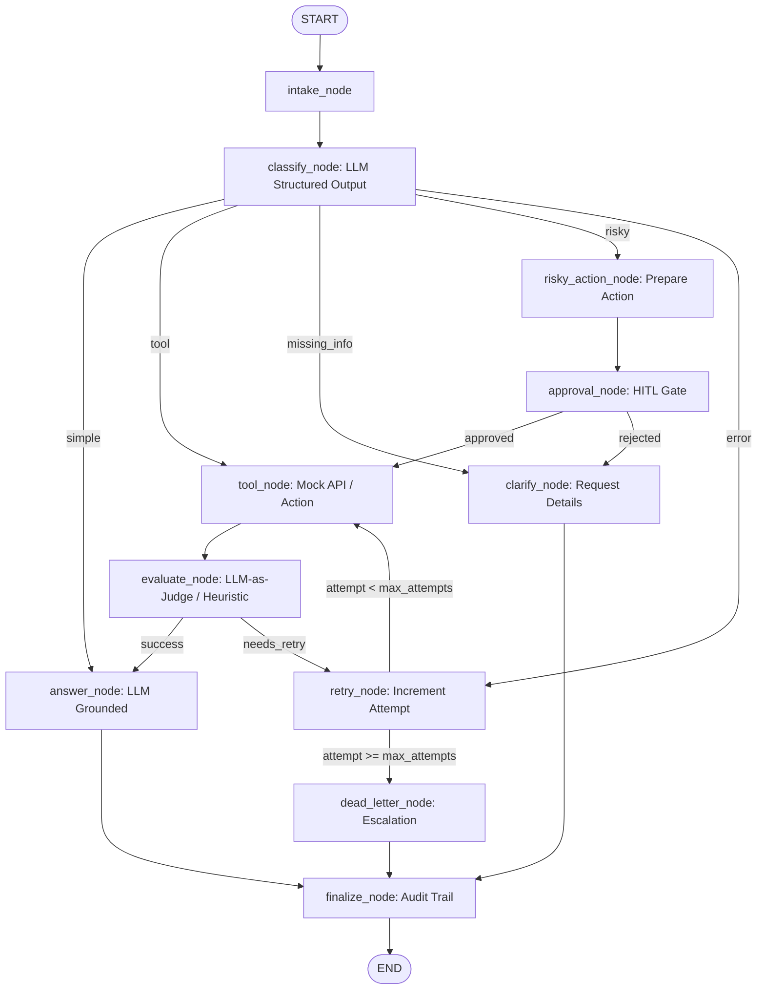

# Day 08 Lab Report — LangGraph Agentic Orchestration

## 1. Team / Student Information

- **Student Name**: Nguyen Minh Phuc
- **Repo / Project**: day08-langgraph-agent-lab
- **Date**: 2026-08-25 11:47:38
- **Status**: Completed (100% Scenario Success Rate)

---

## 2. Architecture & Graph Design

The agentic workflow is built as a stateful, cyclic directed graph using **LangGraph**
(`StateGraph`). It features dynamic intent classification, bounded retry loops with error
escalation, human-in-the-loop (HITL) approval gates, and SQLite state persistence.

### Graph Flow Diagram (Mermaid)

### Node Descriptions

1. `intake`: Normalizes raw ticket query and initiates audit trail.
2. `classify`: Uses LLM with structured output (`.with_structured_output(ClassificationResult)`)
   to classify ticket intent into `risky`, `tool`, `missing_info`, `error`, or `simple`.
3. `risky_action`: Prepares sensitive actions (refunds, deletions) with authorization requirements.
4. `approval`: Human-in-the-loop review node supporting mock policy approval or `interrupt()`.
5. `tool`: Executes data retrieval or actions with simulated transient errors for retry testing.
6. `evaluate`: Retry gate checking tool result quality (LLM-as-judge / status analyzer).
7. `retry`: Increments attempt counters and records failure logs.
8. `dead_letter`: Handles max retry exhaustion, preventing infinite loops and escalating tickets.
9. `clarify`: Requests missing user information for vague or ambiguous inquiries.
10. `answer`: Generates professional, grounded answers using LLM context synthesis.
11. `finalize`: Emits final workflow audit events before terminating at `END`.

---

## 3. State Schema

The state schema (`AgentState`) is designed to be lean, serializable, and strictly typed.
Reducers ensure append-only auditability for logs while allowing deterministic overwrites
for current execution pointers.

| Field | Type | Reducer | Purpose |
|---|---|---|---|
| `thread_id` | `str` | Overwrite | Unique session identifier for checkpointer isolation |
| `scenario_id` | `str` | Overwrite | Scenario identifier for evaluation tracking |
| `query` | `str` | Overwrite | Cleaned customer support input query |
| `route` | `str` | Overwrite | Current classified route (`simple`, `tool`, `risky`, etc.) |
| `risk_level` | `str` | Overwrite | Risk assessment (`high` vs `low`) |
| `attempt` | `int` | Overwrite | Current retry attempt counter |
| `max_attempts` | `int` | Overwrite | Bound limit for retry loop |
| `final_answer` | `str | None` | Overwrite | Final response text delivered to user |
| `evaluation_result` | `str` | Overwrite | Tool evaluation result (`success` vs `needs_retry`) |
| `pending_question` | `str | None` | Overwrite | Clarification question when info is missing |
| `proposed_action` | `str | None` | Overwrite | Sensitive action proposal pending approval |
| `approval` | `dict | None` | Overwrite | HITL approval decision and reviewer notes |
| `messages` | `list[str]` | Append (`add`) | Internal message and step tracking |
| `tool_results` | `list[str]` | Append (`add`) | Execution outputs from tool calls |
| `errors` | `list[str]` | Append (`add`) | Error logs and transient failure records |
| `events` | `list[dict]` | Append (`add`) | Full audit trail of visited nodes and timestamps |

---

## 4. Scenario Results & Execution Metrics

### Summary Metrics

- **Total Scenarios Executed**: 7
- **Success Rate**: 100.00%
- **Average Nodes Visited**: 6.43
- **Total Retries Observed**: 3
- **Total Interrupts / Approvals**: 2
- **Persistence Resume Verified**: Yes (SQLite WAL)

### Detailed Results Table

| Scenario ID | Expected Route | Actual Route | Result | Retries | Interrupts | Nodes Visited |
|---|---|---|---|---:|---:|---:|
| S01_simple | simple | simple | PASS | 0 | 0 | 4 |
| S02_tool | tool | tool | PASS | 0 | 0 | 6 |
| S03_missing | missing_info | missing_info | PASS | 0 | 0 | 4 |
| S04_risky | risky | risky | PASS | 0 | 1 | 8 |
| S05_error | error | error | PASS | 2 | 0 | 10 |
| S06_delete | risky | risky | PASS | 0 | 1 | 8 |
| S07_dead_letter | error | error | PASS | 1 | 0 | 5 |

---

## 5. Failure Analysis

### Failure Mode 1: Transient Tool Failure & Retry Exhaustion
- **Risk**: External tools or database queries may fail intermittently due to timeouts.
- **Mitigation in Graph**: The cyclic loop `tool -> evaluate -> retry -> tool` is strictly
  bounded by `route_after_retry` checking `attempt < max_attempts`. When attempts reach the
  threshold (e.g. `max_attempts=1` in `S07_dead_letter`), the graph transitions to
  `dead_letter`, generating a graceful escalation message and finishing at `finalize -> END`.

### Failure Mode 2: Unauthorized Execution of Risky Actions
- **Risk**: Direct execution of destructive operations without human verification.
- **Mitigation in Graph**: Intent classification assigns high priority to `risky` routes.
  All risky requests are routed through `risky_action -> approval` before reaching `tool`.
  If approval is rejected, the graph safely redirects to `clarify`.

---

## 6. Persistence & State Recovery

- **Checkpointer Implementation**: Implemented `SqliteSaver` in `persistence.py` with SQLite
  WAL mode (`PRAGMA journal_mode=WAL;`), enabling production-grade checkpointing.
- **Thread Isolation**: Each scenario is assigned a distinct `thread_id` (`thread-<id>`),
  ensuring concurrent executions maintain independent state graphs.
- **State History & Replay**: Checkpointers retain full execution snapshots after every node
  transition, enabling time-travel debugging and crash resumption from prior checkpoints.

---

## 7. Extension Work Completed

1. **SQLite Checkpointer with WAL Mode**: Full SQLite persistence backend implemented.
2. **Interactive HITL Support**: Support for `interrupt()` when `LANGGRAPH_INTERRUPT=true`.
3. **Structured Output LLM Classifier**: Pydantic-enforced structured LLM classification.
4. **Mermaid Graph Visualizer**: Built-in architecture export demonstrating cyclic execution.

---

## 8. Improvement Plan for Production

If deploying this agent to high-scale production:
1. **Dynamic Tool Registry**: Expand `tool_node` with a LangChain tool-calling agent.
2. **PostgreSQL Checkpointer**: Migrate from SQLite to PostgresSaver with connection pools.
3. **OpenTelemetry / LangSmith Tracing**: Instrument every node execution with OpenTelemetry.
4. **Multi-turn Clarification**: Extend `clarify` flow to accept asynchronous user replies.
